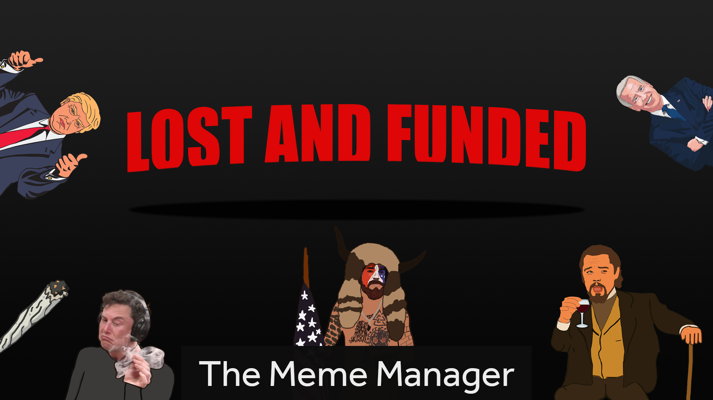

# LostAndFunded-GGJ21

Our GGJ 2021 Project

Play:
https://niklasreinhold.github.io/LostAndFunded-GGJ21/

Lost and Funded is a small but fun Point and Click Adventure. The game plays in a startup office. You are a pretty "lost" company manager that comes up with a different stupid startup idea every time the game starts. As you've learned in your past failed startups the business is tough. So you have to be tougher! Since your' pretty reckless you try to get as much attention as possible (no matter what it takes), because that's the key of getting funded. But keep in mind if your credibility is gone, no one will every fund you! Try to get some money (maybe by corrupting the stock market) and use it to your advantage! Have Fun!

Jam Site:
GGJ Regensburg (regensburg.games)

Jam Year:
2021

Platforms:
MS Windows, Web standard (HTML5, Java, JavaScript, Flash)

Tools And Technologies:
Unity (any product)

Credits:
All credits go to Elon Musk!

Team: florianprechtl, Michi McZero, NiklasR

Project Link: https://globalgamejam.org/2021/games/lost-and-funded-2
